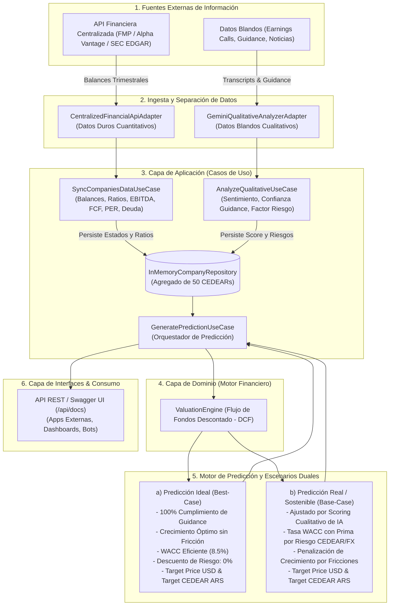

# Documentación Técnica: Plataforma de Análisis Fundamental y Modelo Predictivo de CEDEARs

Esta documentación técnica detalla los fundamentos de diseño, elecciones tecnológicas, patrones arquitectónicos, especificación de contratos de integración y diagramas de flujo de datos para la plataforma de análisis de 50 CEDEARs.

---

## 1. Lenguaje(s) de Programación y Frameworks Seleccionados

### Lenguaje: TypeScript / Node.js (v24 LTS)
* **¿Por qué TypeScript para este dominio?**
  1. **Tipado Estático Riguroso para Modelos Financieros**: En el ámbito financiero y contable, los errores de tipos o valores nulos pueden generar distorsiones críticas en balances, flujos de fondos y múltiplos de valuación. TypeScript garantiza tipado estricto en tiempo de compilación para cada estado financiero (`IncomeStatement`, `BalanceSheet`, `CashFlowStatement`) y entidad de activo (`Company`, `CedearRatio`).
  2. **Ecosistema Asíncrono de Alta Concurrencia (Event Loop no bloqueante)**: La ingesta de 50 empresas/CEDEARs requiere realizar decenas de llamadas HTTP concurrentes a proveedores de datos financieros (FMP, SEC EDGAR) y modelos de IA (Gemini). Node.js maneja cientos de operaciones de E/S simultáneas con mínimo consumo de memoria y sin bloqueos de hilos.
  3. **Interoperabilidad Nativa con Modelos de IA y JSON**: Tanto las respuestas de APIs financieras como las llamadas a Google Gemini (`@google/genai`) y la generación de contratos OpenAPI se basan en esquemas JSON tipados.

### Frameworks y Librerías Principales
* **Express.js (v4.21)**: Framework HTTP minimalista, predecible y desacoplado, ideal para implementar la capa de adaptadores primarios en una Arquitectura Hexagonal. Permite que la lógica de negocio permanezca agnóstica de los controladores web.
* **Swagger-UI-Express & OpenAPI 3.0**: Exposición estandarizada e interactiva de contratos REST para que cualquier aplicación frontend (React, Next.js, Flutter) o pipeline externo (scripts de trading, bots de Telegram/Discord) pueda integrarse sin fricción.
* **Vitest (v3)**: Suite de pruebas unitarias ultrarrápida compatible con módulos ESM nativos, permitiendo verificar los cálculos de flujo de caja descontado (DCF) y los casos de uso en milisegundos.
* **tsx**: Ejecutor TypeScript moderno de desarrollo sin necesidad de builds manuales intermedios.

---

## 2. Estructura de Código y Patrón Arquitectónico

### Patrón Seleccionado: Arquitectura Hexagonal (Ports & Adapters)
Se eligió rigurosamente la **Arquitectura Hexagonal (Puertos y Adaptadores)** combinada con principios de **Clean Architecture** (Dominio en el centro, dependencias apuntando siempre hacia adentro).

#### Justificación de la Elección:
1. **Independencia Total de Fuentes Financieras Externas**: Las APIs financieras externas (Financial Modeling Prep, Alpha Vantage, SEC EDGAR, Yahoo Finance) cambian con frecuencia sus cuotas de uso, precios o formatos de respuesta. En esta arquitectura, el dominio financiero (`ValuationEngine`) jamás llama directamente a una API externa; en su lugar, consume el puerto `FinancialDataProviderPort`. Si en el futuro se migra de FMP a SEC EDGAR o Bloomberg API, **la lógica de valuación no cambia en absoluto**, solo se añade un nuevo adaptador en la capa de infraestructura.
2. **Desacoplamiento del Modelo de IA**: El motor de procesamiento de datos blandos consume `QualitativeAnalyzerPort`. Hoy se conecta con Google Gemini (`GeminiQualitativeAnalyzerAdapter`), pero puede alternarse con modelos locales (Ollama/Llama 3), Claude o GPT sin tocar una sola línea del caso de uso.
3. **Facilidad de Pruebas Unitarias Aisladas**: Como se demostró en la suite de pruebas unitarias, el motor de valuación y los casos de uso pueden probarse al 100% sin depender de internet ni bases de datos activas.

### Organización de Carpetas y Responsabilidades

```
proyecto de cedears/
├── docs/
│   └── TECHNICAL_DOCUMENTATION.md     # Documentación técnica completa
├── src/
│   ├── domain/                         # NÚCLEO PURO DE DOMINIO (Sin dependencias externas)
│   │   ├── entities/
│   │   │   ├── company.ts              # Entidad Empresa y ratio de conversión CEDEAR
│   │   │   ├── financial-statement.ts  # Income Statement, Balance, Cash Flow, EBITDA, FCF, PER
│   │   │   ├── qualitative-data.ts     # Transcripciones, scoring de sentimiento y riesgo IA
│   │   │   └── prediction.ts           # Escenarios duales (Ideal vs. Real Sostenible)
│   │   └── services/
│   │       └── valuation-engine.ts     # Motor matemático: DCF, WACC, TV Gordon y primas CEDEAR
│   │
│   ├── application/                    # CASOS DE USO Y PUERTOS (Orquestación del negocio)
│   │   ├── ports/
│   │   │   ├── financial-data-provider.port.ts  # Contrato para proveedores contables
│   │   │   ├── qualitative-analyzer.port.ts     # Contrato para análisis cualitativo con LLM
│   │   │   └── company-repository.port.ts       # Contrato para persistencia y lectura
│   │   └── use-cases/
│   │       ├── sync-companies-data.use-case.ts  # Ingesta por lote de los 50 CEDEARs
│   │       ├── analyze-qualitative.use-case.ts  # Caso de uso de datos blandos con IA
│   │       ├── generate-prediction.use-case.ts  # Generador de predicción articulada
│   │       └── get-companies.use-case.ts        # Consulta de estado general del catálogo
│   │
│   ├── infrastructure/                 # ADAPTADORES SECUNDARIOS (Salida al mundo exterior)
│   │   └── adapters/
│   │       ├── financial-api/
│   │       │   ├── mock-seed-provider.adapter.ts # Catálogo y estados de 50 CEDEARs BYMA
│   │       │   └── fmp-provider.adapter.ts       # Conector API financiera centralizada
│   │       ├── ai/
│   │       │   └── gemini-analyzer.adapter.ts   # Conector Gemini API con fallback semántico
│   │       └── repositories/
│   │           └── in-memory-company.repository.ts # Repositorio en memoria thread-safe
│   │
│   ├── interfaces/                     # ADAPTADORES PRIMARIOS (Entrada al sistema)
│   │   └── http/
│   │       ├── controllers/            # Controladores HTTP (Transforman req/res)
│   │       ├── routes/                 # Enrutadores Express desacoplados
│   │       ├── middlewares/            # Manejador global de errores
│   │       ├── swagger/
│   │       │   └── openapi.json        # Especificación OpenAPI v3.0 estándar
│   │       └── app.ts                  # Fábrica Express e Inyección de Dependencias
│   │
│   └── server.ts                       # Punto de arranque y bootstrapping del servidor
│
├── tests/                              # SUITE DE PRUEBAS
│   ├── valuation-engine.test.ts        # Tests unitarios del motor financiero
│   ├── use-cases.test.ts               # Tests de integración de casos de uso
│   └── smoke-test.ts                   # Smoke test E2E en vivo
│
├── tsconfig.json                       # Configuración de TypeScript ESM
├── package.json                        # Definición de proyecto y scripts
└── .env.example                        # Plantilla de variables de entorno
```

---

## 3. Especificación de Endpoints y Protocolos de Integración

La plataforma expone una API REST bajo el estándar **OpenAPI 3.0** (accesible interactivamente en `http://localhost:3000/api/docs`).

### Endpoints Principales

| Método | Endpoint | Descripción | Consumo / Propósito |
| :--- | :--- | :--- | :--- |
| `GET` | `/health` | Chequeo de salud del servicio | Monitor de disponibilidad y uptime |
| `GET` | `/api/docs` | Interfaz gráfica Swagger UI | Documentación interactiva de prueba |
| `GET` | `/api/v1/companies` | Lista de las 50 empresas/CEDEARs | Dashboard general y monitoreo de estado |
| `GET` | `/api/v1/companies/:ticker` | Agregado financiero completo | Inspección detallada contable de un ticker |
| `POST` | `/api/v1/ingestion/sync` | Sincronización masiva o selectiva | Ingesta cuantitativa automática de balances |
| `POST` | `/api/v1/analysis/qualitative/:ticker` | Procesamiento con IA de datos blandos | Envío de transcripts, guidance y noticias |
| `GET` | `/api/v1/predictions/:ticker` | Predicción dual para una empresa | Obtención de Target Price Ideal vs Real |
| `GET` | `/api/v1/predictions/batch` | Predicción masiva de todas las empresas | Ranking de valuación para carteras de inversión |

### Protocolo de Integración para Aplicaciones Externas:
* **Formato de Carga**: JSON (`application/json`) con codificación UTF-8.
* **Seguridad / CORS**: Habilitado mediante middleware `cors()` para permitir conexiones desde clientes Web (React, Vue, Angular) y servicios backend externos.
* **Manejo de Errores Unificado**: Todas las respuestas de error retornan:
  ```json
  {
    "success": false,
    "error": {
      "message": "Descripción clara del error",
      "statusCode": 404
    },
    "timestamp": "2026-09-19T23:50:00.000Z"
  }
  ```

---

## 4. Diagrama de Flujo de Datos Simplificado (Mermaid)

El siguiente diagrama ilustra el flujo de datos integral desde la ingesta de las 50 empresas/CEDEARs y el procesamiento de datos cuantitativos y cualitativos, hasta la generación de los dos escenarios de predicción:


